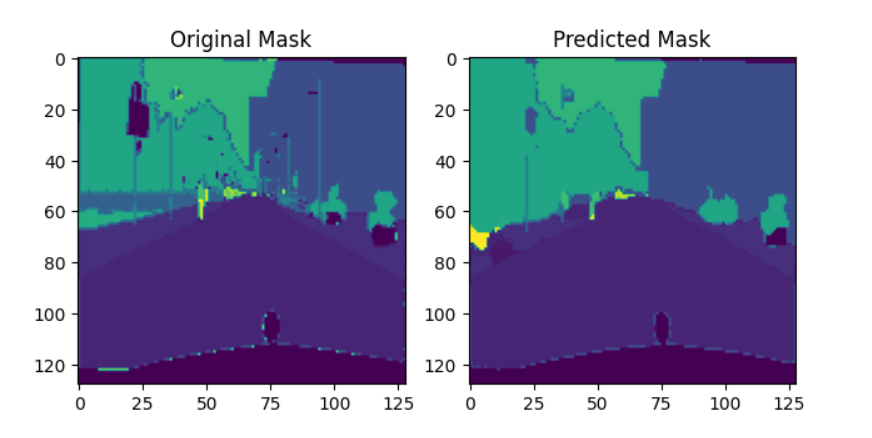
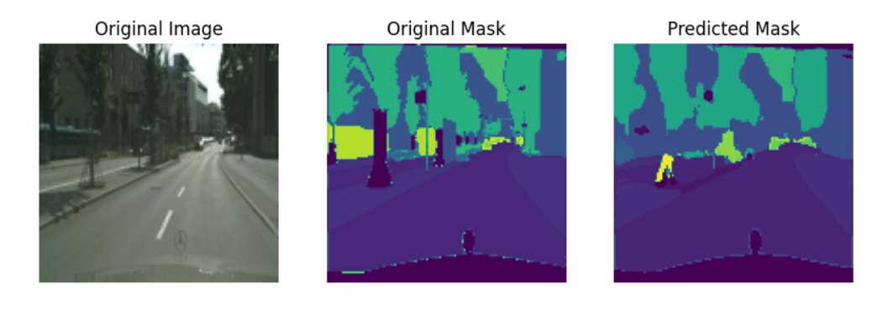
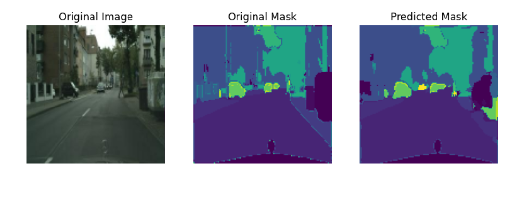

# Semantic Segmentation with TensorFlow 83% Valid Accuracy 🚗🏙️  

Dataset Link:
https://www.kaggle.com/datasets/dansbecker/cityscapes-image-pairs

Runnable Notebook link:
https://www.kaggle.com/code/ahmedayman101/unet-segmentation-with-augmentation

This project focuses on semantic segmentation for **street scene images** using TensorFlow. The model is trained to classify each pixel of an image into one of the 30 predefined classes. These classes represent objects like roads, sidewalks, vehicles, traffic signs, etc. The project demonstrates data preprocessing, model building, training with data augmentation, and evaluation with Intersection over Union (IoU) and accuracy metrics.

---

## 📝 Problem Statement  
Given images from a street scene dataset, the goal is to classify each pixel into one of the following classes:
- **Static objects** like buildings and fences.
- **Roads, sidewalks, and other infrastructure** like rail tracks and bridges.
- **Moving objects** like cars, trucks, cyclists, and pedestrians.

---

## 🔍 Steps Followed  

### 1️⃣ Data Loading  
- The dataset consists of **2097 training images** and **500 validation images**.  
- The images are loaded using TensorFlow’s image loading functions.

### 2️⃣ Data Preprocessing  
- **Image and Mask Creation**: For each image, a corresponding mask image is created, where each pixel is labeled with an integer corresponding to a class.
- **Image Normalization**: The pixel values are normalized to the range `[0, 1]`.
- **Mask Processing**: Masks are converted into one-hot encoded arrays for model compatibility.

### 3️⃣ Dataset Creation with `tf.data` API  
- The dataset is prepared using TensorFlow's `tf.data` API for fast and efficient data loading and batching.
- Data augmentation techniques such as rotation, flipping, and scaling are applied during training.

### 4️⃣ Model Building  
- The model is a **Convolutional Neural Network (CNN)** for semantic segmentation, which predicts the class of each pixel in an image.
- The model architecture includes several convolutional layers, followed by upsampling layers to match the output size of the input image.

### 5️⃣ Training with On-the-Fly Augmentation  
- Training is performed with real-time data augmentation using TensorFlow’s built-in methods.
- The model is trained with **Adam optimizer** and **IoU (Intersection over Union)** as the primary evaluation metric.
- The **visualization_callback** function is used to visualize the model's progress after each epoch.

### 6️⃣ Model Evaluation and Saving  
- After training, the model's performance is evaluated on the validation set using **IoU** and **accuracy**.
- The trained model weights are saved for future use.

---

## 📊 Results  
The model achieved the following performance metrics:

- **Train IoU**: 0.4801  
- **Train Accuracy**: 0.8874  
- **Validation IoU**: 0.3255  
- **Validation Accuracy**: 0.8321

### Result Images
The following image (`img_1.png`) shows the final comparison after each epoch, displaying the ground truth mask and the predicted mask (two values per row):

### Compare after full training
The following images (`img_2.png` and `img_3.png`) show the results after training. Each row consists of three values: the input image, the ground truth mask, and the predicted mask.

### Performance Comparison  
- **TensorFlow vs Numpy**: TensorFlow operations were compared with their Numpy equivalents, showing that TensorFlow operations are **significantly faster** (e.g., TensorFlow processed all images in 0.78 seconds, while Numpy took 240 seconds).

---

## 📑 Classes  
The following are the 30 classes used for semantic segmentation:
in class_names.json file
